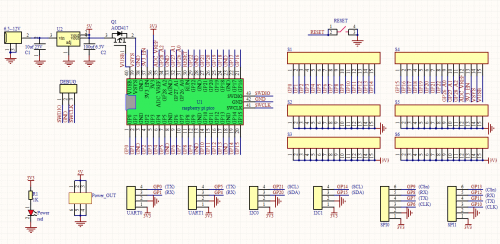

# KS3017 Keyestudio Raspberry Pico IO Shield

## 1. Description

The Raspberry Pico IO shield is designed for the Raspberry Pi Pico development board, without soldering. It also incorporates communications ports like 2 x I2C, 2 x UART, 2 x SPI, 3 x analog IO and 13 x digital IO as well as a 6.5-12V power interface. The integrated Lego position holes can assist to wire up multiple sensors or modules, which exceedingly increase more functions.

## 2. Parameters

- Power supply: 5V
- Output current: ≦500mA
- DC input voltage: 6.5-12V
- Output voltage: DC3.3V\5V
- Recommended ambient temperature: -10°C ~ 50°C
- Size:45.339MM * 83.617MM
- Spacing of pin headers: 2.54mm

## 3. Schematic Diagram

## 4. Pins

- Digital IO x 13:GP2, GP3, GP12 ~ GP22
- Analog IO x 3: GP26, GP27, GP28
- UART x 2: UART0, UART1
- I2C x 2: I2C0, I2C1
- SPI x 2: SPI0, SPI1
- Power interface: 6.5 - 12V

- GPIO pins, are used for the RP2040 chip of the Pico development board, as shown below;
- GPIO29: for ADC mode(ADC3) measure VSYS/3
- GPIO25: connected to LEDs of users
- GPIO24: VBUS sensing-if VBUS exists, it is the high level, in contrast, it is the ow level
- GPIO23: on-board SMPS chip control pin
- In addition to 26 GPIO pins(GP0~GP22, GP26_A0, GP27_A1, GP28_A2) and 7 GND pins, the Pico board has 7 physic pins as follows

- PIN40: VBUS(5V)
- PIN39: VSYS(2~5V)
- PIN37: 3V3_EN(on-board SMPS chip Enable)
- PIN36: 3V3(3.3V)
- PIN35: ADC_VREF(ADC)
- PIN33: AGND(analog)
- PIN30: RUN(boot/forbid Pico)